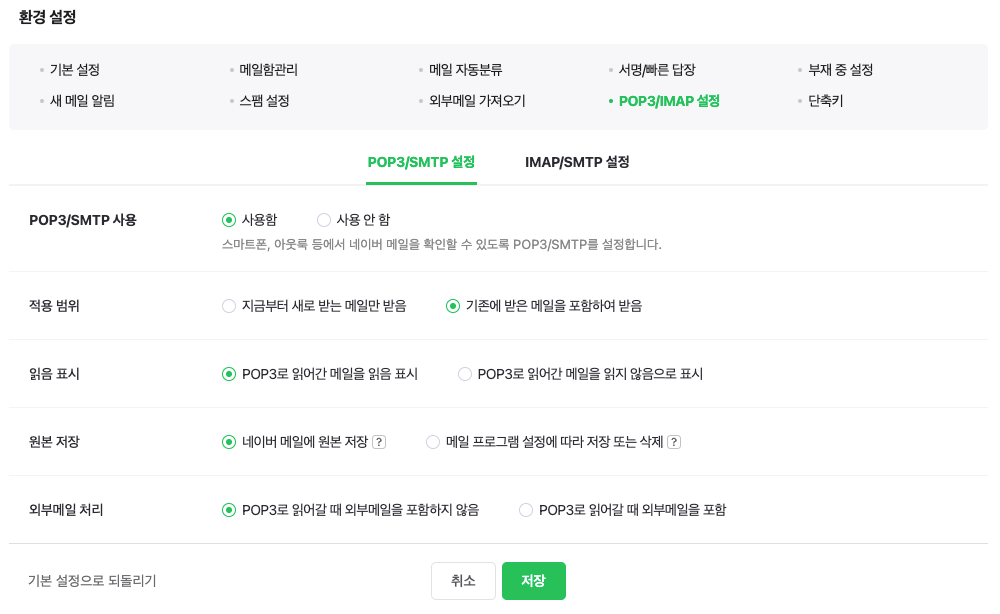

# 🧑🏻‍💻 관리자편

## 💡 필수 사항

### ✔️ Docker 및 Docker Compose 설치

```
https://docs.docker.com/engine/install/
https://docs.docker.com/compose/install/
```

### ✔️ S3 bucket 생성 및 IAM 설정

[S3 및 IAM 가이드](owner_resources/s3_iam_guide.md)

### ✔️ Naver Mail 관련 설정



- POP3/SMTP **사용함** 설정

---

## ⌨️ 설치가이드

### 1️⃣ Git Clone

```bash
git clone https://lab.ssafy.com/s07-final/S07P31A504
cd S07B31A504
```

### 2️⃣ `env.example.txt` 환경 변수 설정

```bash
# Domain of service
DOMAIN=도메인주소

# Mysql
MYSQL_ROOT_PASSWORD=root계정 비밀번호
MYSQL_USER=신규 생성 유저명
MYSQL_PASSWORD=유저 비밀번호
MYSQL_DATABASE=DATABASE 이름

# S3
REGION=s3 지역
ACCESS_KEY=S3 IAM access key
SECRET_KEY=S3 IAM secret key
BUCKET=S3 Bucket이름

# mail - naver 계정만 가능
MAIL_USERNAME=naver아이디
MAIL_PASSWORD=naver비밀번호
```

### 3️⃣ `.env` 파일 생성

```bash
cp env.example.txt .env
```

### 4️⃣ docker image 빌드 및 컨테이너 생성

```bash
docker-compose up -d
```
