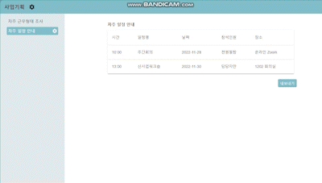

# About O:RE

삼성청년SW아카데미 7기 오픈소스 A504팀(마지막잎새)

`O:RE`는 `그룹웨어 오픈소스` 입니다.

## 💡 O:RE의 특징

!!! info "셀프호스팅 서비스"

    자체 서버 및 DB를 연결하여 해당 서비스에서 발생하는 데이터를 자체적으로 관리!

!!! Success "자유로운 페이지 생성"

    `Drag&Drop 방식`으로 자유롭고 간단하게 사용자의 목적에 따라 페이지 생성 가능!

!!! Tip "세부적인 권한관리"

    `Server` 권한, `Team` 권한, `Page` 권한별로 세부적인 관리 가능!

!!! Note "Excel 활용"

    서비스에서 발생하는 데이터를 `Excel`을 통해 추출 가능!

!!! Abstract "새로운 기능 추가"

    `contribution`을 통해 다양한 기능 확장 가능!

## 🖥 O:RE의 기능

### 📁 페이지 생성

### 📊 Excel 활용

> Excel을 통한 사용자 추가

.

> 생성된 데이터 Excel로 추출

## ⚙️ 권한 설명

??? quote "공통사항"

    - 본인보다 낮은 권한을 가진 유저의 권한을 수정할 수 없다.
        - 동일한 권한을 가진 유저의 권한은 수정할 수 없다.
    - 다른 유저에게 새로 부여하는 권한은 현재 나와 동등한 권한까지 가능하다.
        - 현재 나의 권한보다 높은 권한은 부여할 수 없다.
    - OWNER 권한은 부여할 수 없다.

=== "Server"

    | 권한명      | 권한 내용                          | 특이사항 |
    | :---------- | :----------------------------------- | :--|
    | `OWNER` | 모든 권한 수행 가능 | 서버생성자로 오직 1명 존재. 서버 나가기 불가. |
    | `ADMIN` | 서버에 유저 추가 서버에서 유저 퇴출 유저의 서버 권한 수정  팀 생성 |  |
    | `USER` | - |  |

=== "Team"

    | 권한명      | 권한 내용                          | 특이사항 |
    | :---------- | :----------------------------------- | :--|
    | `OWNER` | 모든 권한 수행 가능 | 서버생성자 |
    | `LEADER` | 팀 정보 수정 팀 삭제  팀에 유저 추가 팀에서 유저 퇴출 유저의 팀 내 권한 수정  페이지 생성 | 팀 생성 시 자동 LEADER(OWNER가 팀 생성시 그대로 OWNER) |
    | `MANAGER` | 팀에 유저 추가 팀에서 유저 퇴출 유저의 팀 내 권한 수정  페이지 생성| |
    | `MEMBER` | - | |

=== "Page"

    | 권한명      | 권한 내용                          | 특이사항 |
    | :---------- | :----------------------------------- | :--|
    | `OWNER` | 모든 권한 수행 가능 | 서버생성자 |
    | `MAINTAINER` | 페이지 삭제  페이지에 Viewer 추가 페이지에서 유저 퇴출 유저의 페이지 내 권한 수정 | 페이지 생성 시 자동 MAINTAINER(OWNER가 생성시 그대로 OWNER) |
    | `EDITOR` | 페이지에 Viewer 추가 페이지에서 Viewer 퇴출 페이지 내 Viewer 권한 수정| |
    | `VIEWER` | 해당 페이지 확인 | |
