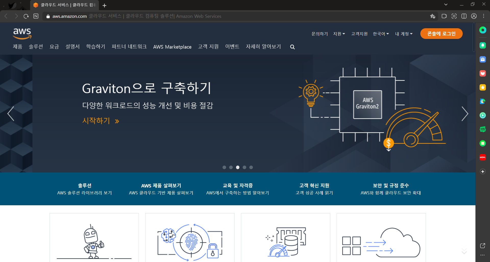

# S3 및 IAM 가이드

## S3 버킷 생성

AWS 접속

 

S3 대시보스 접속 후 버킷 만들기 클릭

 

버킷 이름 및 리전 설정

 

퍼블릭 엑세스 권한 설정

 

버킷 생성

---

## S3 버킷 정책 편집

[정책생성기 홈페이지](https://awspolicygen.s3.amazonaws.com/policygen.html)

Actions : GetObject만 선택

 

Generate Policy 선택

 

내용 복사

 

버킷 정책 편집

---

## IAM 생성

IAM 대시보드 접속 및 사용자추가

 

사용자 이름 작성 및 AWS 자격 증명 유형 액세스키 선택

 

S3FullAccess 정책 추가

 

사용자추가 완료
